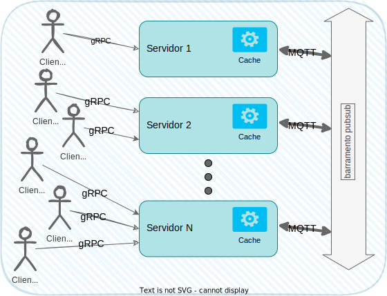

Projeto
=======

A área de computação distribuída é rica em aplicações e desenvolvê-los é topar de frente com vários problemas e decidir como resolvê-los ou contorná-los e, por isto, nada melhor que um projeto para experimentar em primeira mão as angústias e prazeres da área. Assim, proponho visitarmos o material destas notas à luz de uma aplicação genérica mas real, desenvolvida por vocês enquanto vemos a teoria.

O projeto consiste em implementar um sistema de armazenamento chave-valor (_key-value store = KVS_) multi-versão.

A arquitetura do sistema será **híbrida**, contendo um pouco de cliente/servidor, publish/subscribe e Peer-2-Peer, além de ser multicamadas. Apesar de introduzir complexidade extra, também usaremos **múltiplos mecanismos para a comunicação** entre as partes, para que possam experimentar com diversas abordagens.

O sistema utiliza a arquitetura cliente-servidor na comunicação entre o cliente, que realiza as operações em cima do sistema de armazenamento, e o servidor, que atualiza seu estado de acordo e retorna o resultado ao cliente.

Múltiplas instâncias do servidor podem ser executados simultaneamente para prover aumentar a disponibilidade do serviço e/ou atender um maior número de clientes (escalar). O detalhamento do comportamento e implementação, neste caso, será diferente para cada etapa do projeto, sendo detalhado nas seções seguintes.

Tanto a aplicação cliente quanto a aplicação servidor devem, obrigatoriamente, possuir uma interface de linha de comando (_command line interface - CLI_) para execução e interação.

A aplicação cliente manipula cada chave **K** em operações de escrita e leitura de acordo com a descrição e interface apresentada mais adiante. O sistema utiliza a noção de versões **i** de valores, ou seja, cada atualização de uma mesma chave **K** para uma valor **V** gera uma nova versão da mesma. A tupla **(K,V,i)** significa que a chave **K** possui valor **V** em sua versão **i**. Cada atualização para a mesma chave **K** com um novo valor **V'** gera uma nova versão **j**, em que **j = `System.currentTimeMillis()`**[1](#fn:1).

As consultas podem ser feitas sobre uma versão específica ou sobre a versão mais recente da chave. Caso seja especificada uma versão **i**, a consulta deve retornar o valor **V** para a chave **K** com versão imediatamente menor ou igual a **i**.

Tanto as consultas quanto as atualizações pode ser feitas para múltiplas chaves simultaneamente. A API completa é apresentada a seguir.

As chaves e valores devem ser do tipo _String_ enquanto as versões são variáveis do tipo _inteiro longo_.

A comunicação entre cliente e servidor deve ser, obrigatoriamente, realizada via gRPC de acordo com a interface definida adiante. A implementação que não seguir a interface definida não será avaliada e terá atribuída a nota zero.

Casos de Uso
------------

### Interface

O formato exato em que os dados serão armazenados pode variar na sua implementação, mas a API apresentada deve, **obrigatoriamente**, ter a assinada definida a seguir:

```
syntax = "proto3";

option java_multiple_files = true;
option java_package = "br.ufu.facom.gbc074.project";

package project;

message KeyRequest {
  // key
  string key = 1;
  // version
  optional int64 ver = 2;
}

message KeyRange {
    // from this key
    KeyRequest fr = 1;
    // until this key
    KeyRequest to = 2;
}

message KeyValueRequest {
  // key
  string key = 1;
  // value
  string val = 2;
}

message KeyValueVersionReply {
  // key
  string key = 1;
  // value
  string val = 2;
  // version
  int64 ver = 3;
}

message PutReply {
  // key
  string key = 1;
  // value
  string old_val = 2;
  // old version
  int64 old_ver = 3;
  // assigned version
  int64 ver = 4;
}


service KeyValueStore {
  rpc Get(KeyRequest) returns (KeyValueVersionReply) {}
  rpc GetRange(KeyRange) returns (stream KeyValueVersionReply) {}
  rpc GetAll(stream KeyRequest) returns (stream KeyValueVersionReply) {}
  rpc Put(KeyValueRequest) returns (PutReply) {}
  rpc PutAll(stream KeyValueRequest) returns (stream PutReply) {}
  rpc Del(KeyRequest) returns (KeyValueVersionReply) {}
  rpc DelRange(KeyRange) returns (stream KeyValueVersionReply) {}
  rpc DelAll(stream KeyRequest) returns (stream KeyValueVersionReply) {}
  rpc Trim(KeyRequest) returns (KeyValueVersionReply) {}
}
```

### Descrição dos métodos

*   `rpc Get(KeyRequest) returns (KeyValueVersionReply) {}`: retorna valor para chave e versão informados pelo cliente
    *   Cliente:
        *   informa chave e versão que deseja obter do servidor
        *   versão pode ser deixada em branco para obter valor mais recente
    *   Servidor:
        *   retorna chave, valor e versão de acordo com requisição do cliente:
            *   caso versão esteja em branco (valor igual ou menor a zero), retorna valor e versão mais recentes
            *   caso contrário, retorna valor e versão imediatamente menor ou igual à versão informada
*   `rpc GetRange(KeyRange) returns (stream KeyValueVersionReply) {}`: retorna valores no intervalo entre as duas chaves informadas pelo cliente
    *   Cliente:
        *   informa as duas tuplas chave e versão referente ao intervalo de chaves que deseja obter do servidor
        *   versão pode ser deixada em branco para obter valores mais recentes
    *   Servidor:
        *   retorna conjunto de chaves, valores e versões de acordo com requisição do cliente:
            *   caso versões estejam em branco, retorna valores e versões mais recentes
            *   caso contrário, escolhe a maior entre as versões recebidas do cliente e retorna valores e versões imediatamente menores ou iguais a esta versão.
*   `rpc GetAll(stream KeyRequest) returns (stream KeyValueVersionReply) {}`: retorna valores para conjunto de chaves informado pelo cliente
    *   Cliente:
        *   informa conjunto desordenado de tuplas com chave e versão
        *   versão pode ser deixada em branco para obter valores mais recentes
    *   Servidor:
        *   retorna conjunto de chaves, valores e versões de acordo com requisição do cliente:
            *   caso versão esteja em branco, retorna valores e versões mais recentes
            *   caso contrário, escolhe a maior entre as versões recebidas do cliente e retorna valores e versões imediatamente menores ou iguais a esta versão.
*   `rpc Put(KeyValueRequest) returns (PutReply) {}`: atualiza/insere valor e chave informados, retornando valor para chave e versão anteriores, bem como a nova versão atribuída
    *   Cliente:
        *   informa chave e valor para inserir/atualizar no servidor
    *   Servidor:
        *   retorna chave, com valor e versão antigos (se houver), bem como a nova versão atribuída ao valor
*   `rpc PutAll(stream KeyValueRequest) returns (stream PutReply) {}`: atualiza/insere valores e chaves informados, retornando, para cada chave, valor e versão anteriores, bem como a nova versão atribuída
    *   Cliente:
        *   informa conjunto desordenado de tuplas chave, valor
    *   Servidor:
        *   retorna conjunto de tuplas com cada chave, com valor e versão antigos (se houver), bem como a nova versão atribuída ao valor
*   `rpc Del(KeyRequest) returns (KeyValueVersionReply) {}`: remove todos os valores associados à chave e retorna valor para chave e versão mais atual
    *   Cliente:
        *   informa chave que deseja excluir do servidor
        *   versão _deve_ ser deixada em branco
    *   Servidor:
        *   retorna chave, com valor e versão mais recentes, ou valores vazios, caso chave não exista
*   `rpc DelRange(KeyRange) returns (stream KeyValueVersionReply) {}`: remove valores no intervalo entre as duas chaves informadas pelo cliente, retornando os valores mais atuais para estas chaves
    *   Cliente:
        *   informa as duas tuplas, referente ao intervalo de chaves que deseja excluir do servidor
        *   versão _deve_ ser deixada em branco
    *   Servidor:
        *   retorna tuplas com chave, valor e versão mais recentes, ou valores vazios, caso chave não exista
*   `rpc DelAll(stream KeyRequest) returns (stream KeyValueVersionReply) {}`: remove valores para conjunto de chaves informado pelo cliente e retorna valores mais atuais
    *   Cliente:
        *   informa conjunto desordenado de tuplas com as chaves
        *   versão _deve_ ser deixada em branco
    *   Servidor:
        *   retorna tuplas com chave, valor e versão mais recentes, ou valores vazios, caso chave não exista
*   `rpc Trim(KeyRequest) returns (KeyValueVersionReply) {}`: remove todos os valores associados à chave, exceto a versão mais recente, e retorna valor e versão para a chave
    *   Cliente:
        *   informa chave
        *   versão _deve_ ser deixada em branco
    *   Servidor:
        *   retorna chave, com valor e versão mais recentes, ou valores vazios, caso chave não exista

### Retornos

Valores não encontrados são deixados em branco, isto é, deve-se retornar "" (string vazia) para valores não encontrados. Uma versão em branco corresponde a um valor menor ou igual a zero. Exceções (erros de comunicação, formato dos dados, etc, devem ser tratadas ao menos no lado servidor para evitar perda do estado durante os testes.

### Comunicação entre servidores

O suporte a múltiplos servidores deve garantir que clientes possam se conectar a instâncias diferentes de servidores e ainda sim sejam capazes de manipular os dados armazenados. Por exemplo, o cliente _c1_ pode inserir um valor para a chave **K1** no servidor _s1_ e deve ser capaz de recuperar o valor inserir para a mesma chave a partir de um segundo servidor _s2_.

Para isto, cada servidor deve publicar qualquer alteração nas chaves em um broker pub-sub, em tópico conhecido pelos demais, a partir do qual estes receberão as mudanças de estado e atualizarão suas próprias tabelas.

A figura a seguir ilustra a arquitetura exigida para a Etapa 1 do Projeto.



Etapa 1
-------

*   Implementar os casos de uso usando como cache tabelas hash locais aos servidores.
*   Certificar-se de que todas as API possam retornar erros/exceções e que estas são tratadas; explicar sua decisão de tratamento dos erros.
*   Implementar testes automatizados de sucesso e falha de cada uma das operações na API.
*   Documentar o esquema de dados usados nas tabelas.
*   O sistema deve permitir a execução de múltiplos clientes e servidores.
*   Implementar a propagação de informação entre as diversas caches do sistema usando necessariamente _pub-sub_, já que a comunicação é de 1 para muitos.
*   Gravar um vídeo de no máximo 10 minutos demonstrando que os requisitos foram atendidos.

Etapa 2 - Banco de dados Replicado
-------

Nesta etapa você modificará o sistema para que atualizações dos dados sejam feitas persistente e consistentemente entre todas as réplicas usando um protocolo de difusão atômica.

* Objetivos
    * Replicar a base de dados para obter tolerância a falhas.

* Desafios
    * Certificar-se de que os servidores são máquinas de estados determinística
    * Compreender o uso de Difusão Atômica em nível teórico
    * Compreender o uso de Difusão Atômica em nível prático
        * Use Ratis para java
        * Para Python, PySyncObj é uma boa opção
        * Para Rust, raft-rs parece ser a biblioteca mais utilizada
        * Aplicar difusão atômica na replicação do banco de dados
        * Utilizar um banco de dados simples do tipo chave-valor, necessariamente LevelDB ou LMDB
            * Embora originalmente escritas em C++/C, há ports para diversas outras linguagens
        * Utilizar três réplicas para o banco de dados
        * Não há limite para a quantidade de servidores acessados pelos clientes

* Implementação
    * A API para clientes e servidores continua a mesma
    * Requisições feitas pelos clientes via gRPC para o servidor (linha contínua) são encaminhadas via Ratis (linha tracejada)  para ordená-las e entregar a todas as réplicas (linha pontilhada) para só então serem executadas e respondidas
    * Dados são armazenados em disco pela sua máquina de estado da aplicação via Ratis (DBi)

* Testes
    * O mesmo framework de testes deve continuar funcional

* Comunicação
    * Entre cliente e servidor nada é alterado
    * Entre servidores e réplicas do banco de dados, usar Ratis/PySyncOb

* Apresentação
    * Sem alteração, isto é, gravar um vídeo demonstrando que os requisitos foram atendidos.

